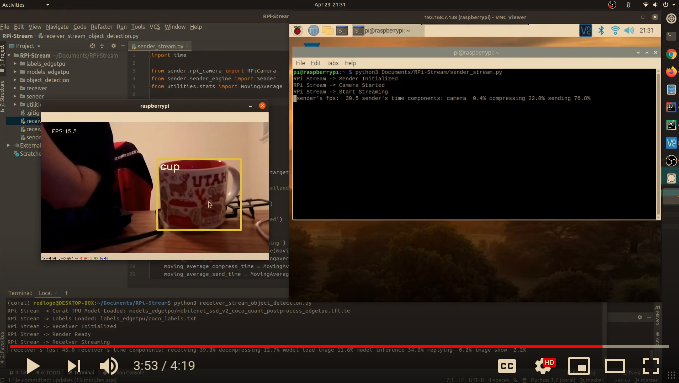

# Fast Raspberry Pi Stream Object Detection - Multi Platform
## Introduction
Live camera stream from Raspberry Pi to local host, do object detection with Coral EdgeTPU on host side.

<br>A FPS 35-45 can be achieved, depending on the network condition. 
<br>Can be used as an AI-powered surveillance camera application.

<br>Multiple platform capability, ready for Ubuntu, MacOS, Windows.
## Video Tutorial
* [A preview of this project](https://www.youtube.com/watch?v=PCdNH4zSNug)
* [](https://www.youtube.com/watch?v=PCdNH4zSNug)
## Preparation and Environment
* Raspberry Pi, [latest RPi4](https://www.raspberrypi.org/products/raspberry-pi-4-model-b/) is recommended.
* Latest [Raspbian](https://www.raspberrypi.org/downloads/raspbian/) is recommended for RPi. 
* A camera for RPi, such as [RPi camera module V2](https://www.raspberrypi.org/products/camera-module-v2/), enable it on RPi.
* A computer (with usb 3.0 port), Ubuntu, MacOS, Windows are supported.
* [Coral EdgeTPU](https://coral.ai/products/accelerator/), USB version is tested in this repo.
* Python virtual env is recommended for both RPi and computer host sides.
  * virtualenv (python3.7) is recommended for RPi.
  * [Anaconda / Conda](https://www.anaconda.com/) (python3.7) is recommended for computer host.
## Installation
Clone this repository on both RPi and computer host sides:
```
git clone https://github.com/redlogo/RPi-Stream.git
```
Install libs needed for Raspberry Pi:
```
bash RPi-requirements.sh
```
Install libs required for local computer host with the USB EdgeTPU unplugged:
```
# Ubuntu
bash computer-hose-requirements-linux.sh
# MacOS
bash computer-host-requirements-macos.sh
# Windows
open computer-host-requirements-windows.txt and install libs accordingly
```
Plug USB EdgeTPU into the host usb 3.0 port.
## Usage
Edit on RPi side, change sender_stream.py:
```
# line 20, change it to your local computer host ip
target_ip = '192.168.7.33'  
```
Firstly execute script on RPi side:
```
python3 sender_stream.py
```
Secondly execute script on local computer host side:
```
python3 receiver_stream_object_detection.py
(Windows: if cannot run, try 'python' or use IDE to execute script instead of Windows CMD)
```
To exit streaming, firstly terminate (ctrl + c) RPi side, then computer host side.
## Coding Style
General Python 3 Coding style.
## Version
1.0 - April 2020.
## Author
redlogo
## References and Acknowledgements
* [Coral EdgeTPU](https://coral.ai/)
* [Python library of imagezmq](https://github.com/jeffbass/imagezmq)
* [A brilliant project by EdjeElectronics](https://github.com/EdjeElectronics/TensorFlow-Lite-Object-Detection-on-Android-and-Raspberry-Pi)
## License
MIT
## Copyright
Copyright © 2020 redlogo